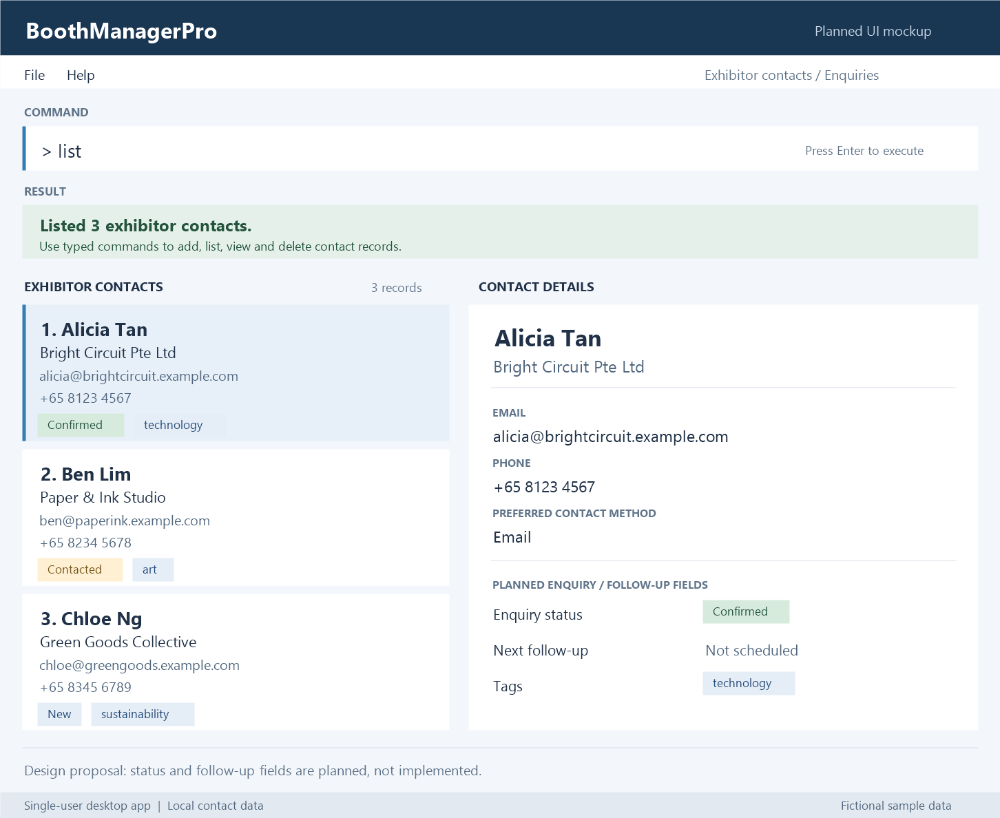

BoothManagerPro is a **desktop application for convention organisers to manage exhibitor contacts through typed commands**, with a graphical contact list and details panel.

* Table of Contents
{:toc}

--------------------------------------------------------------------------------------------------------------------

## Quick start

1. Ensure that Java `25` or later is installed on your computer.<br>
   **Mac users:** Ensure you have the precise JDK version prescribed [here](https://se-education.org/guides/tutorials/javaInstallationMac.html).

1. Build the development JAR after following the [setup guide](SettingUp.md): run `.\gradlew.bat shadowJar` on Windows or `./gradlew shadowJar` on macOS/Linux. The JAR is generated at `build/libs/boothmanagerpro.jar`.

1. Copy the file to the folder you want to use as the _home folder_ for BoothManagerPro.

1. Open a terminal, `cd` to the folder containing the JAR file, and run `java -jar boothmanagerpro.jar`.<br>
   The application opens with sample contacts on first launch. The image below is the planned UI mockup; some fields await integration.<br>
   

1. Type a command in the command box and press Enter to execute it. For example, type **`help`** and press Enter to open the help window.<br>
   Some example commands you can try:

   * `list` : Lists all contacts.

   * `add n/John Doe c/Example Ltd e/johnd@example.com p/98765432` : Adds an exhibitor contact named `John Doe`.

   * `delete Alex Yeoh` : Deletes the contact named Alex Yeoh.

   * `clear` : Deletes all contacts.

   * `exit` : Exits the app.

1. Refer to the [Features](#features) section below for details of each command.

--------------------------------------------------------------------------------------------------------------------

### Workspace controls

* Click the result heading to collapse or expand command feedback. New feedback reopens it automatically; long results scroll within a compact area.
* Drag the divider between the contact list and details to adjust their widths. Both panels use the space freed when feedback is collapsed.
* Expand **Enquiries & follow-ups** in contact details to see the planned-feature note.

## Features

<div markdown="block" class="alert alert-info">

**:information_source: Notes about the command format:**<br>

* Words in `UPPER_CASE` are the parameters to be supplied by the user.<br>
  For example, in `add n/NAME`, replace `NAME` with a value such as `John Doe`.

* Items in square brackets are optional.<br>
  For example, `n/NAME [t/TAG]` can be used as `n/John Doe t/friend` or as `n/John Doe`.

* Items followed by `…`​ can appear zero or more times.<br>
  For example, `[t/TAG]…​` may be omitted, or written as `t/friend` or `t/friend t/family`.

* Parameters can be in any order.<br>
  For example, if the command specifies `n/NAME p/PHONE_NUMBER`, `p/PHONE_NUMBER n/NAME` is also acceptable.

* Extraneous parameters for commands that take no parameters, such as `help`, `exit`, and `clear`, are ignored.<br>
  For example, `help 123` is interpreted as `help`. The exception is `list`, which rejects any parameters.

* If you are using a PDF version of this document, be careful when copying and pasting commands that span multiple lines as space characters surrounding line-breaks may be omitted when copied over to the application.
</div>

### Viewing help: `help`

Shows a message explaining how to access the help page.


Format: `help`


### Adding an exhibitor contact: `add`

Adds an exhibitor or representative with a required company, email, and phone number.

Format: `add n/NAME c/COMPANY e/EMAIL p/PHONE [m/METHOD] [t/TAG]...`

| Field | Rules |
| --- | --- |
| `n/NAME` | 1-80 characters; at least one letter. Allows letters, spaces, hyphens, apostrophes, and full stops. |
| `c/COMPANY` | 1-100 characters; cannot be blank. |
| `e/EMAIL` | Valid email format, such as `alicia@example.com`; stored in lowercase. |
| `p/PHONE` | 7-15 digits, optionally starting with `+`. Spaces and hyphens are removed. |
| `m/METHOD` | Optional: `email`, `phone`, or `other`, ignoring case. Omitted method is `Not specified`. |
| `t/TAG` | Optional and repeatable: 1-30 characters, nonblank, without `/`. Identical tags are ignored; comparisons are case-sensitive. |

Leading and trailing spaces are removed from field values. Fields can appear in any order. Only `t/` may repeat. The old `a/ADDRESS` field is not accepted by `add`.

Examples (enter each command on one line):

```text
add n/Alicia Tan c/TechNova Pte Ltd e/alicia@technova.com p/91234567 m/email t/technology t/high-priority
add n/Ben Lim c/GreenWorks e/BEN@example.com p/+65 8765-4321
```

The first command displays:

```text
New exhibitor contact added:
Alicia Tan at TechNova Pte Ltd
Email: alicia@technova.com
Phone: 91234567
Contact method: email
Tags: technology, high-priority
```

The second stores `ben@example.com` and `+6587654321`, with method `Not specified` and tags `None` in the feedback. Company and contact method are saved and included in command feedback; both also appear in the selected contact's details panel.

**Duplicate handling**

A contact is rejected if any stored contact has the same normalised email, or the same name and company ignoring case. This includes contacts hidden by the current search. Sharing only a name or company is allowed if the email is different. Legacy contacts without a company are compared by email only.

For a match against Alicia's record above:

```text
This contact may already exist: Alicia Tan at TechNova Pte Ltd.
Use the edit command if you want to update the existing contact.
```

The current `edit` command can update name, email, phone, address, and tags; it cannot yet change company or contact method.

**Input errors**

| Problem | Feedback |
| --- | --- |
| Missing `n/`, `c/`, `e/`, or `p/` | `Missing required field: NAME, COMPANY, EMAIL, or PHONE.` |
| Repeated field other than `t/` | `Each field can only be specified once.` |
| Unknown prefix or text before the first prefix | `Unknown field prefix. Use n/, c/, e/, p/, m/, or t/.` |
| Invalid name | `Names must be 1 to 80 characters and contain a letter. Use only letters, spaces, hyphens, apostrophes or full stops.` |
| Invalid company | `Company name must contain 1 to 100 characters.` |
| Invalid email | `Email address is invalid.` |
| Invalid phone | `Phone number must contain 7 to 15 digits.` |
| Invalid method | `Contact method must be email, phone, or other.` |
| Invalid tag | `Tag must be 1 to 30 characters and cannot contain '/'.` |

A present but empty field produces its value-validation error. Words between prefixes belong to the preceding field; prefix-like tokens are reserved. If several errors occur, unknown prefixes/preamble are checked first, then repeated fields, then missing prefixes, then values. Invalid input and duplicates do not add a contact.

### Listing all exhibitor contacts: `list`

Shows every stored exhibitor contact with its name, company, email, phone, preferred contact method, and tags,
followed by the total number of contacts.

Format: `list`

* `list` does not accept parameters. For example, `list 3` is rejected.
* Any filter left by a previous `find` or `view` command is cleared, so all contacts are shown again.
* Tags are shown in the order they are stored. An omitted contact method or a company missing from an older
  record is shown as `Not specified`. Contacts without tags show `None`.

Example: `list`

```text
Exhibitor Contact List
──────────────────────────────────────

Alicia Tan at TechNova Pte Ltd
Email: alicia@technova.com
Phone: 91234567
Contact method: email
Tags: technology, high-priority

John Smith at GlobalTech Inc
Email: john@globaltech.com
Phone: +6562345678
Contact method: phone
Tags: hardware

──────────────────────────────────────
Total contacts: 2
```

If there are no stored contacts:

```text
No contacts found.
Use the 'add' command to add a new exhibitor contact.
```

### Viewing an exhibitor contact: `view`

Shows matching contacts in the left panel and the chosen contact's details in the right panel, with command feedback in the result area.

Format: `view n/NAME`

* Matching follows unprefixed `find KEYWORD`: case-insensitive whole-name keywords, matching **any** supplied keyword.
  For example, `view n/rhineson` matches both `rhineson` and `rhineson kok`; `rhin` does not match `rhineson`.
* Names must contain 1 to 80 characters and at least one letter. Letters, spaces, hyphens, apostrophes,
  and full stops are supported, for example `Anne-Marie O'Neil`.
* Searches all stored contacts, including those hidden by a previous `find` command.
* If several contacts match, the left panel and result show the same numbered choices with their companies.
  The right panel prompts you to choose a contact.
  Enter the corresponding number as your next command, for example `2`.
  The chosen contact is highlighted on the left and their full details appear on the right.
  A single match is selected automatically.
* An invalid number shows the valid range and lets you try again. Another recognised command cancels the pending choice.
* Only `n/` is accepted. Repeated names, other prefixes, missing/invalid names, and unprefixed requests are rejected.
* Viewing does not change saved data. It filters the displayed list to the matches; use `list` to show everyone again.
* An omitted contact method or a company missing from an older record is shown as `Not specified`.
  Contacts without tags show `None`.

Example: `view n/Alicia Tan`

```text
Exhibitor contact found:
Alicia Tan at TechNova Pte Ltd
Email: alicia@technova.com
Phone: 91234567
Contact method: email
Tags: high-priority, technology
```

Create these records with `add n/NAME c/COMPANY e/EMAIL p/PHONE [m/METHOD] [t/TAG]...`.

### Editing a person: `edit`

Edits an existing person in the address book.

Format: `edit INDEX [n/NAME] [p/PHONE] [e/EMAIL] [a/ADDRESS] [t/TAG]…​`

* Edits the person at the specified `INDEX`. The index refers to the index number shown in the displayed person list. The index **must be a positive integer** 1, 2, 3, …​
* At least one of the optional fields must be provided.
* Existing values will be updated to the input values. Name, email, phone, and tags follow the validation rules described under `add`.
* Company and contact method are preserved; `edit` does not yet support `c/` or `m/`. Changes that create a duplicate are rejected.
* When editing tags, all of the person's existing tags are removed; adding tags is not cumulative.
* To remove all of a person's tags, enter `t/` without a tag after it.

Examples:
*  `edit 1 p/91234567 e/johndoe@example.com` Edits the phone number and email address of the 1st person to be `91234567` and `johndoe@example.com` respectively.
*  `edit 2 n/Betsy Crower t/` Edits the name of the 2nd person to be `Betsy Crower` and clears all existing tags.

### Finding and filtering contacts: `find`

Use prefixed criteria to match complete field values:

Format: `find [n/NAME] [c/COMPANY] [e/EMAIL] [p/PHONE] [t/TAG]...`

* Supply at least one non-empty criterion. Each value must follow the same format as when adding a contact;
  phone values accept spaces and hyphens, just as `add` does. Internal tabs are not accepted.
* Names, companies, emails, and tags ignore case and surrounding whitespace. Phone comparisons ignore spaces and hyphens.
* Repeat a prefix for alternatives (OR). Different fields must all match (AND).
* Tags match complete tag names; any matching tag satisfies that field.
* Duplicate criteria have no effect. Results always search all stored contacts, not just the current displayed list.
* Unknown prefixes and empty/invalid values are rejected without changing the displayed list or stored contacts.
* Company (`c/`) matches the complete stored company name. Legacy contacts without a company do not match this field.
* Enquiry status (`s/`) and contact method (`m/`) are not searchable. Status tracking remains planned.
* `list` restores all contacts. A result count of zero means no contacts matched.

Examples:

* `find n/Alice Pauline` matches the complete name, not just `Alice`.
* `find n/Alice Pauline n/Benson Meier t/friends` returns either named contact if they also have the `friends` tag.
* `find e/alice@example.com p/9435-1253` requires both email and phone to match.
* `find c/TechNova Pte Ltd t/high-priority` requires both company and tag to match.
* `find t/technology t/food` returns contacts tagged with either label.

#### Legacy name-keyword search

Finds persons whose names contain any of the given keywords.

Format: `find KEYWORD [MORE_KEYWORDS]`

* The search is case-insensitive; for example, `hans` matches `Hans`.
* Keyword order does not matter; for example, `Hans Bo` matches `Bo Hans`.
* The search considers only names.
* Only full words match; for example, `Han` does not match `Hans`.
* Persons matching at least one keyword are returned (an `OR` search); for example, `Hans Bo` returns `Hans Gruber` and `Bo Yang`.

Examples:
* `find John` returns `john` and `John Doe`
* `find alex david` returns `Alex Yeoh`, `David Li`<br>
  

### Deleting a person: `delete`

Deletes the specified person from the address book.

Format: `delete NAME` or `delete INDEX`

* `NAME` must be the contact's full name (matching is case-insensitive); do not include `n/`.
* Name deletion searches all stored contacts, including contacts hidden by a filter. Success feedback includes company and contact method.
* A partial name does not match. For example, `delete Alex` does not match `Alex Yeoh`.
* If no contact has the supplied name, no contact is deleted and an error is shown.
* If multiple contacts match the supplied name ignoring letter case, no contact is deleted. Use `list` or `find`,
  then delete the intended contact by its displayed index.
* Alternatively, deletes the person at the specified `INDEX`.
* The index refers to the index number shown in the displayed person list.
* The index **must be a positive integer** 1, 2, 3, …​

Examples:
* `delete Alex Yeoh` deletes the contact named Alex Yeoh.
* `list` followed by `delete 2` deletes the 2nd person in the address book.
* `find Betsy` followed by `delete 1` deletes the 1st person in the results of the `find` command.

### Clearing all entries: `clear`

Clears all entries from the address book.

Format: `clear`

### Exiting the program: `exit`

Exits the program.

Format: `exit`

### Saving the data

BoothManagerPro automatically saves data after successful commands, except `view` and its numbered selection replies, which do not write the data file. You do not need to save manually.

### Editing the data file

By default, BoothManagerPro saves data as `data/addressbook.json`, relative to the folder from which you launch the app. Advanced users are welcome to update data directly by editing that data file.

<div markdown="span" class="alert alert-warning">:exclamation: **Caution:**
If your changes make the data file invalid, BoothManagerPro starts with an empty address book at the next run. The invalid file remains on disk until a command executes successfully and saves data. Still, we recommend backing up the file before editing it.<br>
Furthermore, certain edits can cause BoothManagerPro to behave in unexpected ways (e.g., if a value entered is outside of the acceptable range). Therefore, edit the data file only if you are confident that you can update it correctly.
</div>

### Archiving data files `[coming in v2.0]`

_Details coming soon ..._

--------------------------------------------------------------------------------------------------------------------

## FAQ

**Q**: How do I transfer my data to another computer?<br>
**A**: Install the app on the other computer and overwrite the data file it creates with the data file from your previous BoothManagerPro home folder.

--------------------------------------------------------------------------------------------------------------------

## Known issues

1. **If you minimize the Help Window** and then run the `help` command (or use the `Help` menu, or the keyboard shortcut `F1`) again, the original Help Window will remain minimized, and no new Help Window will appear. The remedy is to manually restore the minimized Help Window.

--------------------------------------------------------------------------------------------------------------------

## Command summary

Action | Format, Examples
--------|------------------
**Add** | `add n/NAME c/COMPANY e/EMAIL p/PHONE [m/METHOD] [t/TAG]...` <br> e.g., `add n/James Ho c/Example Ltd e/jamesho@example.com p/22224444 m/phone t/technology`
**Clear** | `clear`
**Delete** | `delete NAME` or `delete INDEX`<br> e.g., `delete Alex Yeoh`
**Edit** | `edit INDEX [n/NAME] [p/PHONE_NUMBER] [e/EMAIL] [a/ADDRESS] [t/TAG]…​`<br> e.g., `edit 2 n/James Lee e/jameslee@example.com`
**Find** | `find [n/NAME] [c/COMPANY] [e/EMAIL] [p/PHONE] [t/TAG]...` or `find KEYWORD [MORE_KEYWORDS]`<br> e.g., `find n/Alice Pauline t/friends`
**List** | `list`
**View** | `view n/NAME`<br> e.g., `view n/Alicia Tan`; reply `2` if prompted to choose between matches
**Help** | `help`
